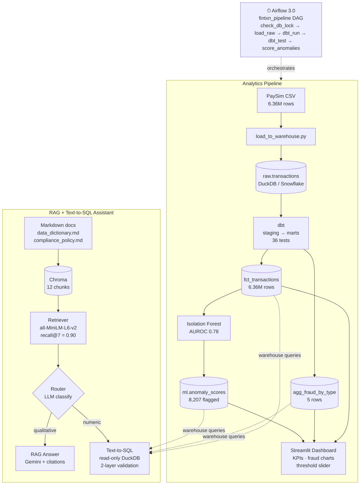
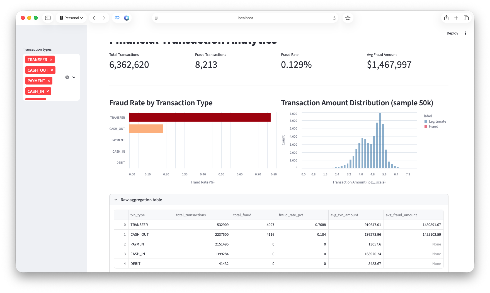
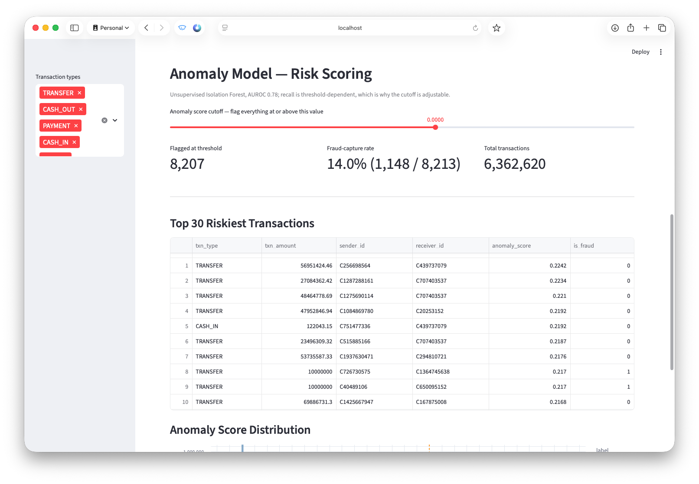
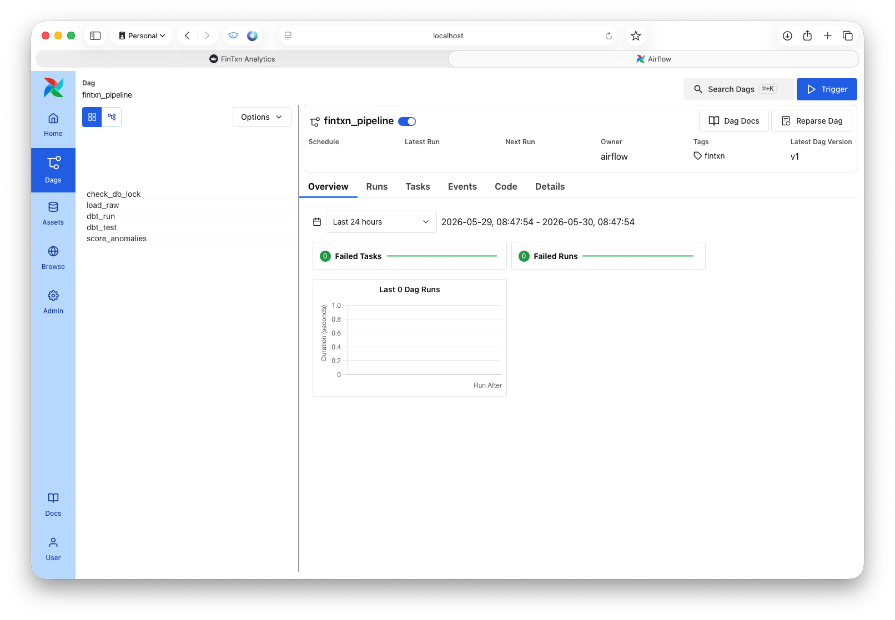

# FinTxn Platform

Fraud analytics platform for mobile money transaction data. Ingests and transforms 6.36M PaySim transactions through a dbt pipeline, flags anomalies with an unsupervised Isolation Forest model, and surfaces results through a Streamlit dashboard. A document-grounded query assistant (RAG + text-to-SQL) lets analysts ask questions about the warehouse schema and AML compliance policy in plain language.

---

## Benchmarks

| Metric | Result |
|---|---|
| Dataset | 6.36M PaySim mobile-money transactions |
| dbt tests | 36 / 36 passing |
| Isolation Forest AUROC | 0.78 (unsupervised; no labels seen during training) |
| Retrieval recall@7 | 0.90 (9/10) |
| MRR | 0.833 |
| RAG answer correctness | 0.700 (7/10, LLM-as-judge) |
| SQL exact-match accuracy | 0.889 (8/9) |
| Routing accuracy | 0.957 (22/23) |
| Guardrail catch rate | 4/4 |
| SQL safety | Two independent read-only layers |

---

## Architecture



---

## Tech stack

| Layer | Technology |
|---|---|
| Warehouse | DuckDB 1.x (local dev) · dbt-snowflake adapter installed for production |
| Transformation | dbt-core 1.10, dbt-duckdb, dbt-snowflake |
| ML | scikit-learn — Isolation Forest |
| Orchestration | Apache Airflow 3.0 (standalone mode) |
| Dashboard | Streamlit + Altair |
| Vector store | ChromaDB 1.5, all-MiniLM-L6-v2 (ONNX, local) |
| LLM | Google Gemini (`google-genai` SDK) |
| Language | Python 3.9+ |

---

## Components

### Analytics pipeline

Raw ingestion reads PaySim CSV directly into DuckDB using `read_csv` — no pandas in the ingestion path. dbt builds three models: `stg_transactions` (view, renaming and type cleaning), `fct_transactions` (table, 6.36M rows with derived risk columns), and `agg_fraud_by_type` (table, aggregated by transaction type for the dashboard). 36 schema tests cover nullability, uniqueness, accepted values, and a custom singular test that verifies fraud only appears in TRANSFER and CASH_OUT types.

The anomaly model is an Isolation Forest trained on 9 structural features with the contamination parameter set to the observed fraud rate (0.129%) rather than the sklearn default. Scores write to a separate `ml` schema that dbt never touches. After scoring, predictions are evaluated against ground-truth labels, which are intentionally withheld from the training path.

Airflow 3.0 runs the pipeline as a linear DAG: lock check → raw load → dbt run → dbt test → anomaly scoring. The dbt test step is a hard gate — scoring is skipped if any data quality check fails.

The Streamlit dashboard connects to DuckDB in read-only mode. The anomaly threshold slider recalculates precision and recall in memory without issuing additional database queries.

### Query assistant

The assistant answers questions about the warehouse schema and AML compliance policy from two documents: `data_dictionary.md` (all mart table columns, with notes flagging unreliable or placeholder fields) and `compliance_policy.md` (four AML rules, each with a directly-runnable SQL predicate).

Documents are chunked at `##` section headers and embedded locally with `all-MiniLM-L6-v2` via Chroma's ONNX runtime. A grounding threshold blocks out-of-scope questions before they reach the LLM.

The text-to-SQL path injects a live schema snapshot with inline column notes — notably distinguishing `is_anomaly` (model output) from `is_flagged_fraud` (simulator's internal flag, nearly always 0). Every generated query passes through two independent read-only safeguards before execution: a regex-based blocked-keyword check and a physical read-only DuckDB connection. One automatic retry if execution fails.

A router classifies each question as qualitative (→ RAG) or numeric/aggregate (→ SQL) with a single LLM call, defaulting to RAG on ambiguous inputs.

The eval harness covers 25 labeled questions across four categories: RAG, SQL, out-of-scope guardrail, and acceptable-either-way. Non-LLM metrics complete in ~18 Gemini calls; the full run with LLM-as-judge takes ~52 calls.

---

## Screenshots

### Streamlit Dashboard



Fraud is structurally confined to two transaction types — TRANSFER (76.9% fraud rate, 4,097 cases) and CASH_OUT (18.4%, 4,116 cases) — while PAYMENT, CASH_IN, and DEBIT show exactly zero fraud across a combined 3.6M transactions. TRANSFER accounts for only 8.4% of total volume but produces nearly half of all fraud. The average fraudulent transaction is $1.47M, roughly 1.6× the average legitimate TRANSFER ($910K), suggesting fraudsters systematically target high-value movements. The log-scale amount distribution confirms the two populations overlap heavily in the $63K–$400K range, which is why amount alone is a weak signal without transaction type context.

### Anomaly Scoring Panel



At the default threshold the Isolation Forest flags 8,207 transactions and captures 1,148 of 8,213 true frauds (14% recall). The low recall at default is expected for an unsupervised model trained without labels — the contamination parameter was set to the observed fraud rate (0.129%), not tuned against a labeled validation set. The threshold slider trades recall for precision in real time: sliding left captures more fraud at the cost of more false positives. The top 30 riskiest transactions are dominated by TRANSFER type, consistent with the 76.9% fraud rate seen in the aggregation dashboard.

### Airflow DAG



The `fintxn_pipeline` DAG runs five tasks in sequence: `check_db_lock → load_raw → dbt_run → dbt_test → score_anomalies`. The pipeline shows 0 failed tasks and 0 failed runs. The ordering is intentional — `score_anomalies` is positioned after `dbt_test` so that any data quality failure (broken schema, unexpected nulls, fraud appearing in an unexpected transaction type) halts the run before model scores are written to the warehouse.

---

## Getting started

### Prerequisites

```bash
git clone https://github.com/your-username/fintxn-platform
cd fintxn-platform
python3 -m venv .venv
source .venv/bin/activate
pip install dbt-core dbt-duckdb dbt-snowflake duckdb scikit-learn \
    streamlit altair chromadb google-genai apache-airflow \
    python-dotenv pandas numpy
```

Add your Gemini API key:

```bash
cp .env.example .env   # then edit .env and set GEMINI_API_KEY=your_key
```

Download the [PaySim dataset](https://www.kaggle.com/datasets/ealaxi/paysim1), rename the CSV to `paysim.csv`, and place it at `data/raw/paysim.csv`.

### Running the pipeline

```bash
# 1. Ingest
python ingestion/load_to_warehouse.py

# 2. Transform + test
cd transform && dbt run --profiles-dir . && dbt test --profiles-dir . && cd ..

# 3. Score anomalies
python models/anomaly_detector.py

# 4. Dashboard
streamlit run dashboard/app.py       # → http://localhost:8501

# 5. Airflow (optional)
./airflow/start.sh                   # → http://localhost:8080

# 6. RAG assistant
python rag/ingest_docs.py
python rag/router.py "What are the five largest anomalous transfers?"

# 7. Eval harness
python rag/eval/run_eval.py --minimal   # ~18 LLM calls
python rag/eval/run_eval.py             # ~52 LLM calls, includes LLM-as-judge
```

> **Note:** DuckDB allows only one writer at a time. Stop Streamlit (`pkill -f streamlit`) before running ingestion or scoring.

> **macOS:** `start.sh` sets `OBJC_DISABLE_INITIALIZE_FORK_SAFETY=YES` — required to prevent gunicorn worker SIGSEGV due to fork-safety checks after native library loading.

---

## Project structure

```
fintxn-platform/
├── data/raw/                  # PaySim CSV (gitignored)
├── ingestion/
│   └── load_to_warehouse.py   # CSV → DuckDB raw.transactions
├── transform/                 # dbt project
│   ├── models/staging/        # stg_transactions (view)
│   └── models/marts/          # fct_transactions, agg_fraud_by_type (tables)
├── models/
│   └── anomaly_detector.py    # Isolation Forest → ml.anomaly_scores
├── dashboard/
│   └── app.py                 # Streamlit
├── airflow/
│   ├── dags/fintxn_pipeline.py
│   └── start.sh
├── docs/
│   ├── data_dictionary.md
│   └── compliance_policy.md
├── rag/
│   ├── ingest_docs.py         # chunk + embed docs → Chroma
│   ├── retriever.py           # similarity search with grounding threshold
│   ├── answer.py              # RAG generation with citations
│   ├── text_to_sql.py         # schema-injected SQL generation + 2-layer safety
│   ├── router.py              # qualitative vs numeric classifier
│   └── eval/
│       ├── eval_set.jsonl     # 25 labeled questions
│       └── run_eval.py        # eval harness
└── fintxn.duckdb              # local warehouse (gitignored)
```
